# Projeto Final: luiza < CODE >

## API: Carrinho de compras de um e-commerce de roupas 

Esse repositório contém a implementação do projeto final do luiza < CODE >. Trata-se de uma API de carrinho de compras utililizando rotas, validações e banco de dados.

---
## :hammer: Requisitos e Ferramentas:

    .Python3
    .MongoDB
    .FastAPI
    .Uvicorn

Somente é necessário ter o Python3 pré instalado para a execução do projeto. Outras dependências são gerenciadas pelo gerenciador de pacotes.

---
## :construction: Instalação e execução:

Após instalar o Python3:

1. Clone [este repositório](https://github.com/makuntz/luizaCODE_ProjetoFinal) através do comando:

   `git clone`

   <b>Importante: </b> Certifique-se de estar clonando a branch main (master).

2. Ciração e ativação do ambiente virtual (Opcional):
   `python -m venv venv`
   `venv\Scripts\activate`

3. Instale as dependências do projeto na pasta raíz:

   `pip install -r requirements.txt`

4. Na pasta raíz rode o projeto, inicie a aplicação utilizando o comando:

   `uvicorn main:app --reload`

Esse comando compila o projeto, iniciando o cliente em:

> http://localhost:8000.
---
## ⚙️ Funcionamento:

Ao acessar a URL

> http://localhost:8000

A primeira rota/pagina (página principal) é apenas as boas vindas do projeto. Portanto nesse endereço acima, deverá aparecer:

`Seja bem vinda!`

---
## :page_facing_up: Documentação Swagger:

Nessa etapa também é possível acessar a documentação Swagger através da URL:

> http://localhost:8000/docs

Essa é uma documentação nativa da FastAPI. Para mais informações acesse a documentação a documentação [aqui](https://fastapi.tiangolo.com/tutorial/first-steps/#interactive-api-docs).

---
## 💻 Divisão do Projeto:

O projeto foi arquitetado em pastas, onde cada pasta possui arquivos com responsabilidades própria.
A divisão de pastas foi feita da seguinte forma:

- <b>Controllers:</b> Possui o controle das rotas.
- <b>Models:</b> Ações relacionadas a alterações no banco de dados.
- <b>Regras:</b> Definições de regras de negócio
- <b>Routers:</b> Armazena a configuração de rota principal.
- <b>Schemas:</b> Declaração de classes onde é feita a interface dos objetos trabalhados ao longo do projeto.
- <b>Server:</b> É onde é feita as configurações da nosso _database_, assim como as definições das nossas coleções.

Já a divisão das responsabilidades são:

- <b>User: Catiussia e Lya</b>
- <b>Address: Manuela e Maíra</b>
- <b>Products: Marcella</b>
- <b>Carts: Maíra e Lya</b>

---
## :memo: Regras de negócio:

### O que será possivel fazer:
 - [x] Cadastro de usuário
 - [x] Cadastro de endereço
 - [x] Pesqisar um cliente por email
 - [x] Pesquisar um endereço por email
 - [x] Cadastrar um produto
 - [x] Atualizar os dados de um produto pelo código
 - [x] Pesquisar um produto pelo código
 - [x] Pesquisar um produto pelo nome
 - [x] Criar um carrinho de compras e adicionar itens ao carrinho.

### O que não será possível fazer:
- Remover um cliente
- Remover um endereço 
- Remover um produto
- Consultar os carrinhos fechados de um cliente
- Consultar os produtos e suas quantidades em carrinhos fechados
- Consultar quantos carrinhos fechados os clientes possuem 
- Excluir carrinho do cliente

---
## :globe_with_meridians: Rotas e endpoints:

Os endpoints disponíveis são:

### Home

##### GET "/" 
Retorna a página inicial.

### Products 

##### GET "/api/products" 
Retorna todos os produtos cadastrados. 

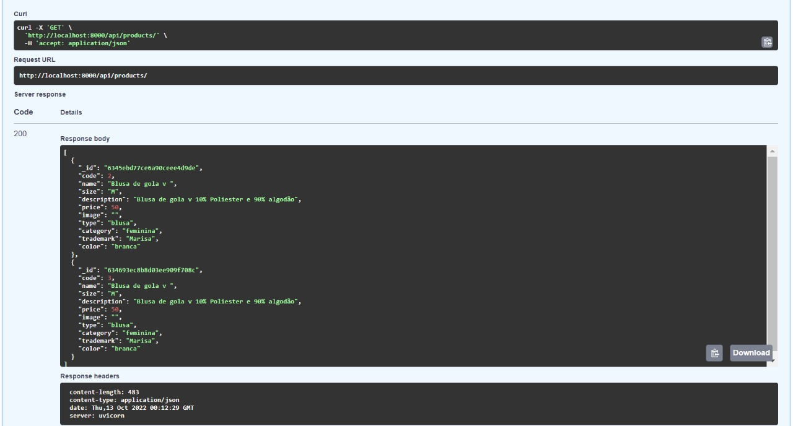

##### POST "/api/products" 
Cadastra um novo produto.

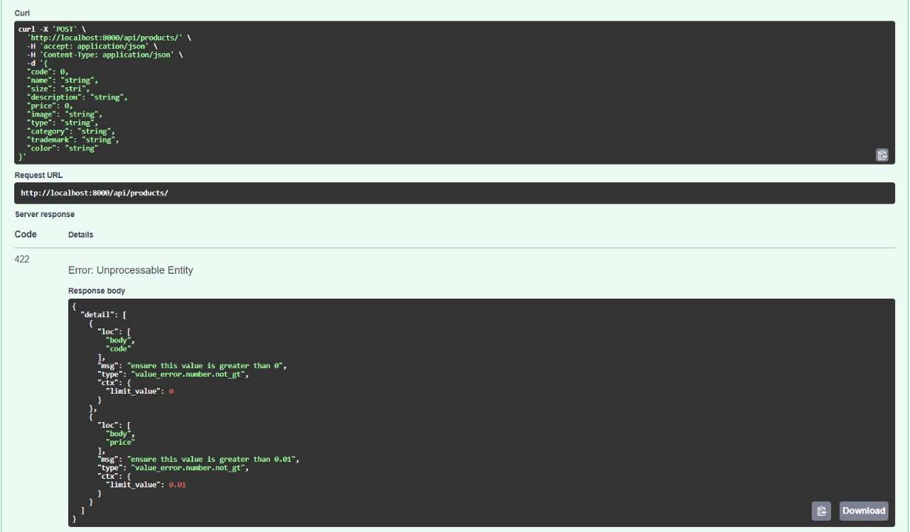

##### GET "/api/products/{id_product}/" 
Retorna o produto pelo id. 

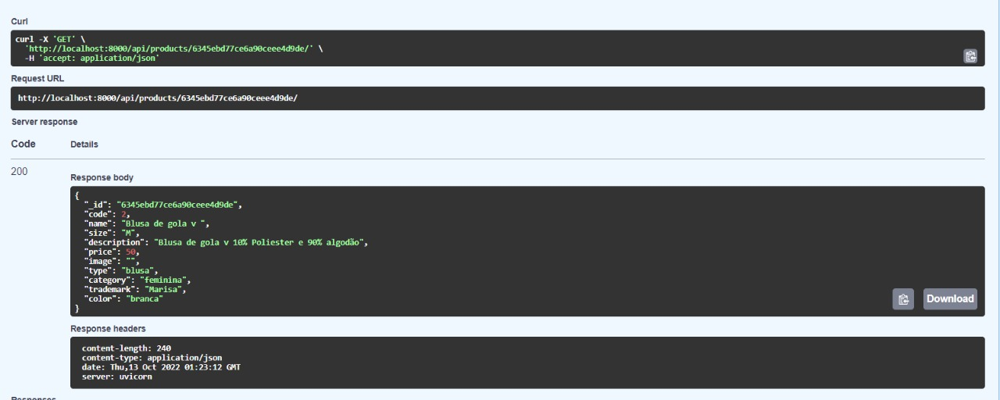

##### DELETE "/api/products/{id_product}/" 
Deleta o produto. 

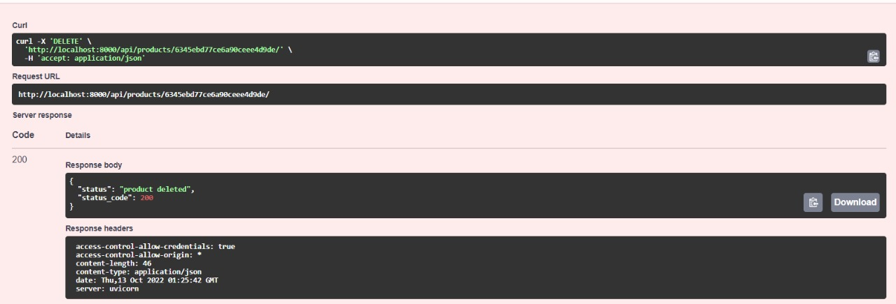

##### GET "/api/products/code/{code}/"
Busca o produto pelo código.

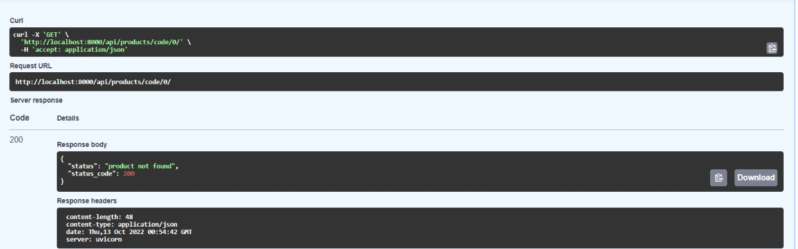

##### GET "/api/products/name/{name}/"
Busca o produto pelo nome.

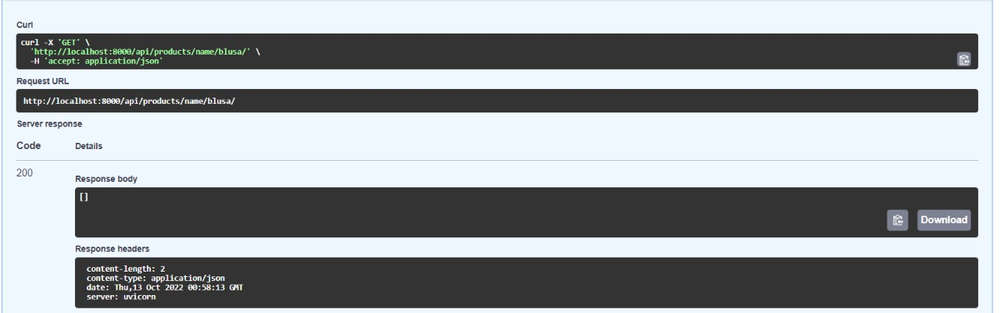

##### PUT "/api/products/{id_produto}"
Atualiza o produto.

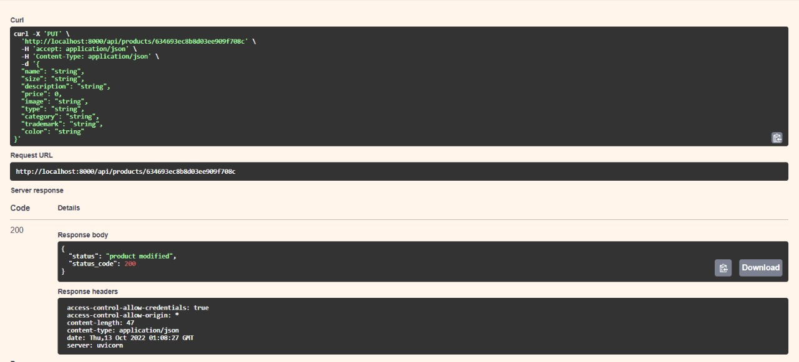

### Users

##### POST "/api/user" 
Cadastra um novo usuário:

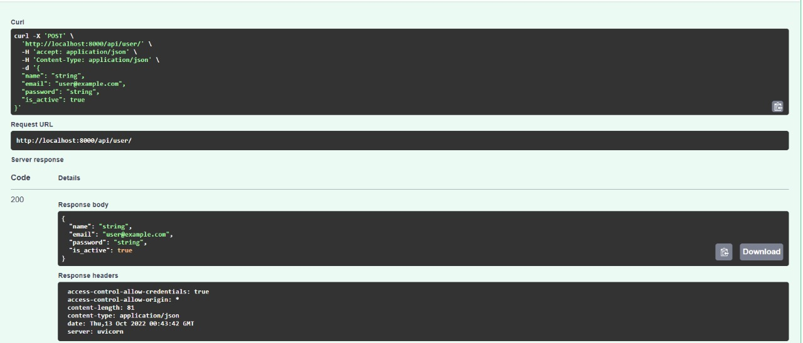

##### GET "/api/user/" 
Retorna todos os usuários.

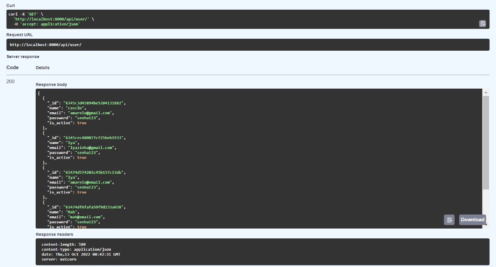

##### GET "/api/user/{email}" 
Busca um usuário pelo email passado como parâmetro.

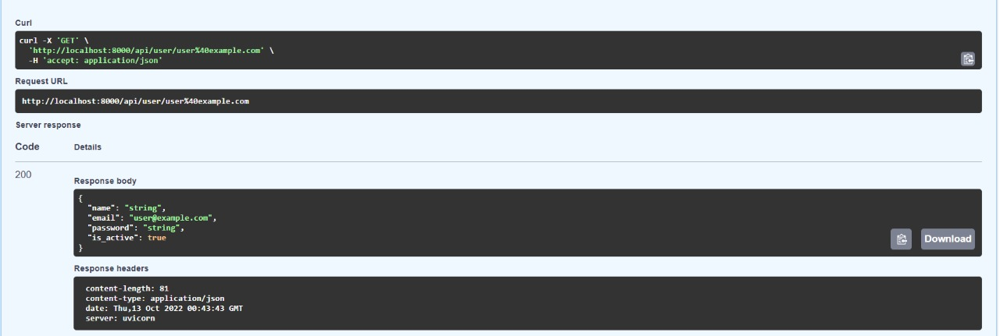

### Address

##### POST "api/address/{id_user}"
Adiciona um novo endereço ao usuário.

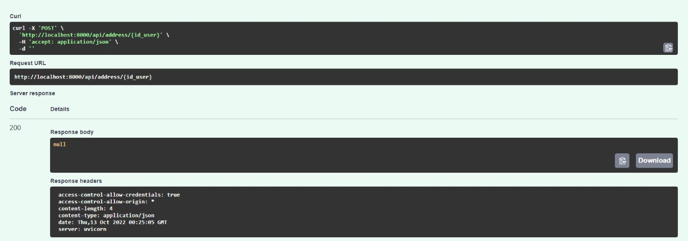

##### GET "api/address/{email}" 
Faz busca do endereço através do email que for passado como parâmetro.

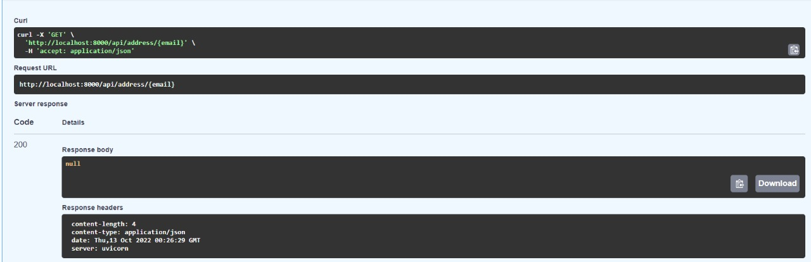

### Cart
##### POST "api/cart/{email}" 
Cria um novo carrinho.

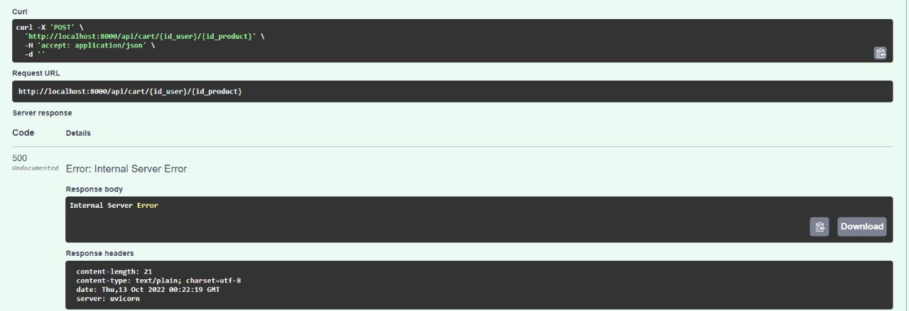

##### PUT "api/cart/{id_user}/{id_product}" 
Adicionar um produto no carrinho.

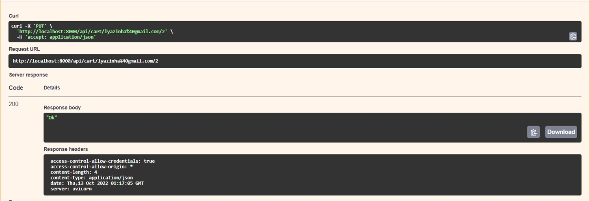

---
## :rocket: Desenvolvedoras: 

<table>
    <tr align="center">
       <td>
            
        </td>
        <td>
          
        </td>
        <td>
            
        </td>
        <td>
            
        </td>
         <td>
            
        </td>
    </tr>
    <tr align="center">
        <td>
        <a href="https://github.com/catiuu" target="_blank">Catiussia Nascimento</a>
        </td>
        <td>
        <a href="https://github.com/lyacarolina" target="_blank">Lya Carolina</a>
        </td>
        <td>
        <a href="https://github.com/makuntz" target="_blank">Maíra Kuntz</a>
        </td>
         <td>
        <a href="https://github.com/manuelaagr" target="_blank">Manuela Rocha</a>
        </td>
        <td>
        <a href="https://github.com/MarcellaMenezes" target="_blank">Marcella Menezes</a>
        </td>
    </tr>
</table>